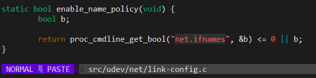
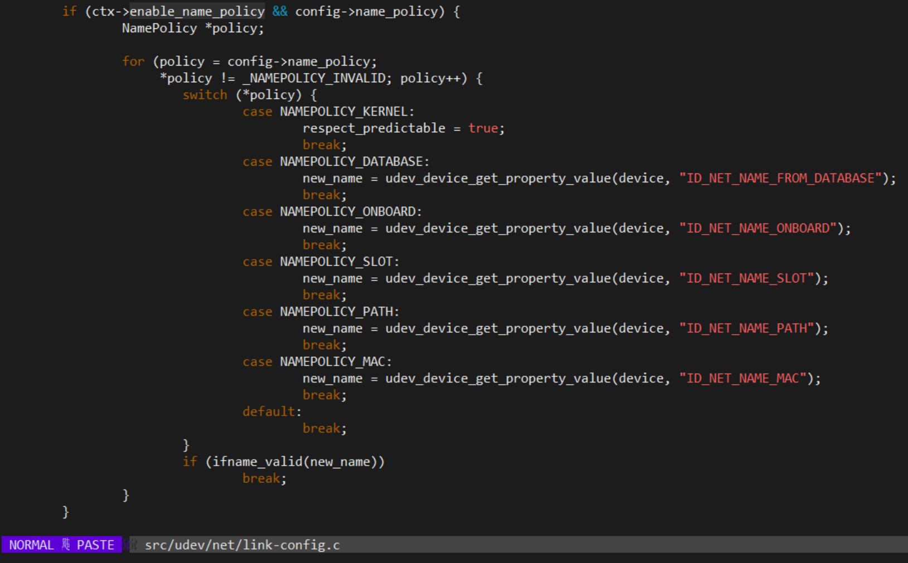
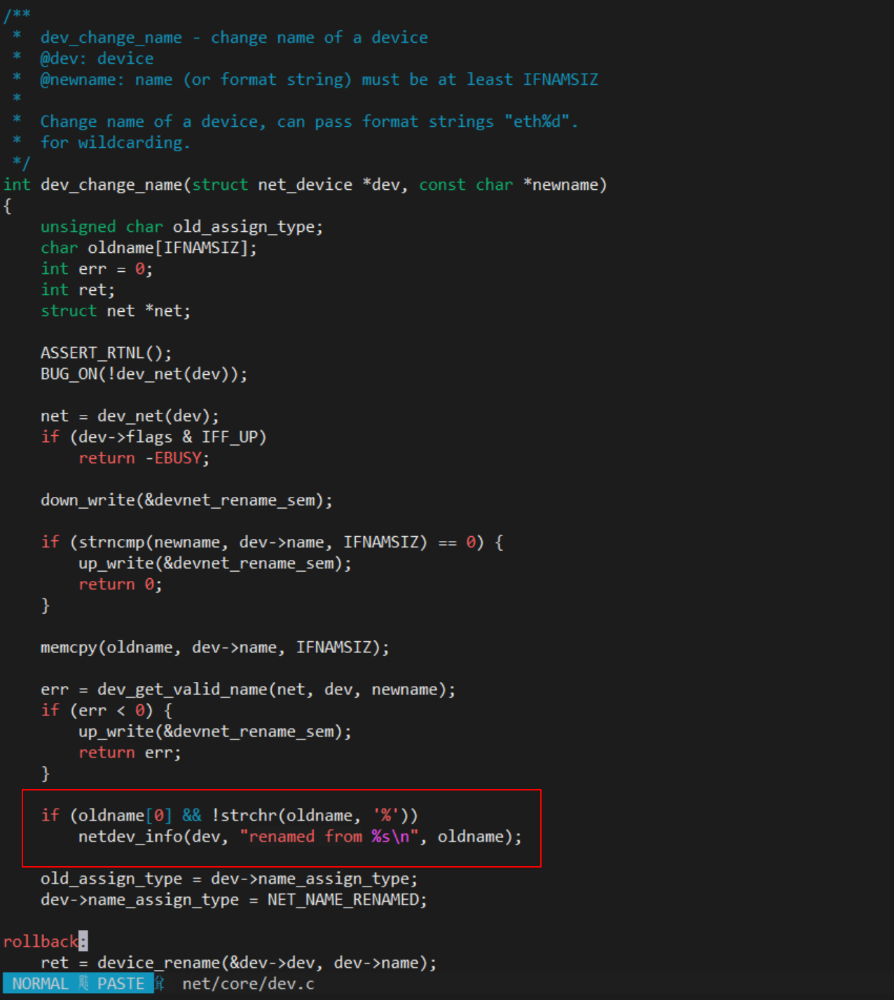
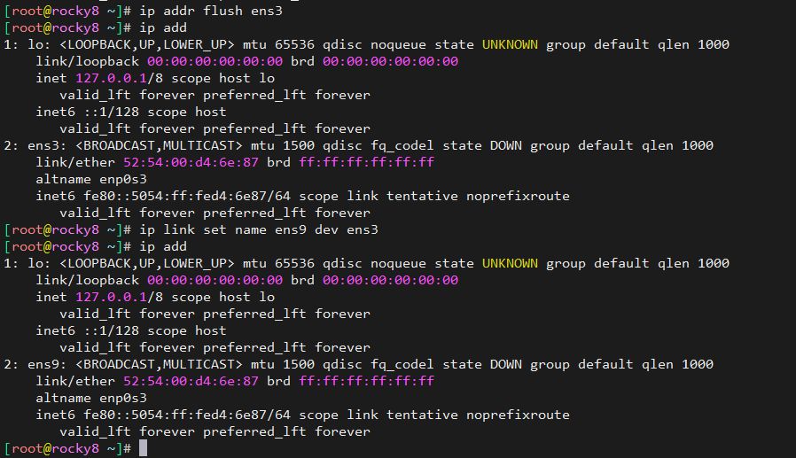
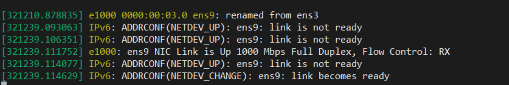

# net.ifnames和biosdevname有什么作用？谁去解析的？

## 引用

* <https://www.man7.org/linux/man-pages/man8/systemd-udevd.8.html>

## 什么作用？

net.ifnames和biosdevname是两个启动参数，用于控制网卡的命名规则。不同组合会有不同效果

* net.ifnames默认值1，表示默认启用 systemd 的可预测网络接口命名行为。biosdevname取决于系统是否安装biosdevname包，如果安装，默认1。
* biosdevname需要安装特定包，只有安装了biosdevname这个包才有效，它是 Dell 开发的 biosdevname 工具，该工具会根据 BIOS 提供的信息来生成类似 em1, p3p4 命名方式。默认值为1，且优先级较高


| net.ifnames | biosdevname | 效果                                                                                       |
| ----------- | ----------- | ------------------------------------------------------------------------------------------ |
| 0           | 0           | 基于内核探测顺序(重启会与之前不一致)，依次eth0、eth1...                                    |
| 1           | 0           | systemd 的可预测网络接口命名行为，该行为会根据网卡的类型和位置来生成类似 enp5s2 这样的名称 |
| 0           | 1           | 安装biosdevname情况下，基于udev，根据BIOS信息给网卡提供一致的命名机制                      |
| 1           | 1           | 效果稍微复杂，整体是biosdevname机制优先于systemd机制                                       |

如果同时设置了net.ifnames=1和biosdevname=1，那么系统会按照以下顺序处理udev的规则来重命名网卡：

1. 如果网卡有固定的MAC地址，那么使用biosdevname的命名方式。
2. 如果网卡是PCI设备，那么使用systemd的命名方式。
3. 如果网卡是USB设备，那么使用MAC地址的命名方式。
4. 如果以上都不适用，那么使用传统的eth [0123…]的命名方式。

因此，biosdevname的命名方式基本上优先于systemd的命名方式，在实现方式上，biosdevname使用udev，因此它的优先级就高于systemd。
上述几种情况，也可以完全通过udev来实现，直接不采用systemd机制。

biosdevname是一个udev的辅助工具，它可以根据BIOS信息给网卡提供一致的命名机制，例如em1, p4p1等。

biosdevname的作用是为了解决传统的eth0, eth1等命名方式在多网卡服务器上可能造成的混乱和不一致问题。
优点是它可以根据网卡的物理位置来命名，而不是依赖于MAC地址或者内核检测的顺序，这样可以避免在更换网卡或者重装系统时导致网卡名称变化的问题。
biosdevname还可以支持虚拟功能网络接口的命名，例如p3p4_1表示PCI第三个插槽的网卡上的第一个虚拟接口。
biosdevname内部调用了dmidecode等BIOS工具来获取PCI号等BIOS信息，从而为网卡取一个**有意义的名字**


谁去解析？

```
[root@rocky8 /data/systemd.git/BUILD/systemd-239]# grep -rni "biosdevname"
[root@rocky8 /data/systemd.git/BUILD/systemd-239]# grep -rni "net\.ifnames"
NEWS:6883:          with a new kernel command line switch: net.ifnames=0.
man/kernel-command-line.xml:248:        <term><varname>net.ifnames=</varname></term>
man/systemd-udevd.service.xml:167:        <term><varname>net.ifnames=</varname></term>
man/systemd-udevd.service.xml:177:          <varname>net.ifnames=0</varname> is specified, see above). With this kernel command line option it
man/systemd.link.xml:256:          <literal>net.ifnames=0</literal> on the kernel command line.
src/udev/net/link-config.c:186:        return proc_cmdline_get_bool("net.ifnames", &b) <= 0 || b;
test/fuzz/fuzz-unit-file/directives.service:275:net.ifnames=
```

* 检索systemd代码，可以看到net.ifnames有解析函数，但是biosdevname没有
* 实际上，biosdevname是独立的rpm包，我的rocky，至少我没有刻意安装，默认就带了
* 它是基于udev配置和一个sbin目录下的二进制构成






```
[root@rocky8 /data/systemd.git/BUILD/systemd-239]# rpm -qa|grep biosdevname
biosdevname-0.7.3-2.el8.x86_64
[root@rocky8 /data/systemd.git/BUILD/systemd-239]# rpm -ql biosdevname
/usr/lib/.build-id
/usr/lib/.build-id/1e
/usr/lib/.build-id/1e/cb44ba2be8b17cb6d1c3e21cb08787a45a0298
/usr/lib/udev/rules.d/71-biosdevname.rules
/usr/sbin/biosdevname
/usr/share/doc/biosdevname
/usr/share/doc/biosdevname/COPYING
/usr/share/doc/biosdevname/README
/usr/share/man/man1/biosdevname.1.gz
[root@rocky8 /data/systemd.git/BUILD/systemd-239]# rpm -qi biosdevname
Name        : biosdevname
Version     : 0.7.3
Release     : 2.el8
Architecture: x86_64
Install Date: Mon 06 Jun 2022 12:15:13 PM CST
Group       : System Environment/Base
Size        : 64284
License     : GPLv2
Signature   : RSA/SHA256, Mon 12 Apr 2021 11:42:41 AM CST, Key ID 15af5dac6d745a60
Source RPM  : biosdevname-0.7.3-2.el8.src.rpm
Build Date  : Mon 15 Mar 2021 03:29:56 AM CST
Build Host  : ord1-prod-x86build002.svc.aws.rockylinux.org
Relocations : (not relocatable)
Packager    : infrastructure@rockylinux.org
Vendor      : Rocky
URL         : http://linux.dell.com/files/biosdevname
Summary     : Udev helper for naming devices per BIOS names
Description :
biosdevname in its simplest form takes a kernel device name as an
argument, and returns the BIOS-given name it "should" be.  This is necessary
on systems where the BIOS name for a given device (e.g. the label on
the chassis is "Gb1") doesn't map directly and obviously to the kernel
name (e.g. eth0).
[root@rocky8 /data/systemd.git/BUILD/systemd-239]# biosdevname --help
biosdevname: unrecognized option '--help'
Usage:  biosdevname [options] [args]...
 Options:
   -i        or --interface           treat [args] as ethernet devs
   -d        or --debug               enable debugging
   -p        or --policy [physical | all_ethN ]
   -P        or --prefix [string]     string use for embedded NICs (default='em')
   -s        or --smbios [x.y]         Require SMBIOS x.y or greater
   -x        or --nopirq               Don't use $PIR table for slot numbers
   -v        or --version             Show biosdevname version
 Example:  biosdevname -i eth0
  returns: em1
  when eth0 is an embedded NIC with label '1' on the chassis.
 You must be root to run this, as it must read from /dev/mem.
```

看下它的udev规则，就很清晰命令，去解析启动参数

```
[root@rocky8 /data/systemd.git/BUILD/systemd-239]# cat /usr/lib/udev/rules.d/71-biosdevname.rules
SUBSYSTEM!="net", GOTO="netdevicename_end"
ACTION!="add",    GOTO="netdevicename_end"
NAME=="?*",       GOTO="netdevicename_end"
ATTR{type}!="1",  GOTO="netdevicename_end"
ENV{DEVTYPE}=="?*", GOTO="netdevicename_end"

# kernel command line "biosdevname={0|1}" can turn off/on biosdevname
IMPORT{cmdline}="biosdevname"
ENV{biosdevname}=="?*", ENV{UDEV_BIOSDEVNAME}="$env{biosdevname}"
# ENV{UDEV_BIOSDEVNAME} can be used for blacklist/whitelist
# but will be overwritten by the kernel command line argument
ENV{UDEV_BIOSDEVNAME}=="0", GOTO="netdevicename_end"
ENV{UDEV_BIOSDEVNAME}=="1", GOTO="netdevicename_start"

# off by default
GOTO="netdevicename_end"

LABEL="netdevicename_start"

# using NAME= instead of setting INTERFACE_NAME, so that persistent
# names aren't generated for these devices, they are "named" on each boot.
SUBSYSTEMS=="pci", PROGRAM="/sbin/biosdevname --smbios 2.6 --nopirq --policy physical -i %k", NAME="%c"  OPTIONS+="string_escape=replace"

LABEL="netdevicename_end"
```


biosdevname这个包，不被其他包依赖。依赖的组件有限，但是并没有涉及到dmidecode？

```
[root@rocky8 /data/systemd.git/BUILD/systemd-239]# repoquery --nvr --whatrequires biosdevname
Last metadata expiration check: 0:00:25 ago on Tue 11 Jul 2023 10:18:13 AM CST.
[root@rocky8 /data/systemd.git/BUILD/systemd-239]# yum deplist biosdevname
Last metadata expiration check: 0:01:39 ago on Tue 11 Jul 2023 10:18:13 AM CST.
package: biosdevname-0.7.3-2.el8.x86_64
  dependency: libc.so.6(GLIBC_2.14)(64bit)
   provider: glibc-2.28-225.el8.x86_64
   provider: glibc-2.28-225.el8.x86_64
  dependency: libpci.so.3()(64bit)
   provider: pciutils-libs-3.7.0-3.el8.x86_64
   provider: pciutils-libs-3.7.0-3.el8.x86_64
  dependency: libpci.so.3(LIBPCI_3.0)(64bit)
   provider: pciutils-libs-3.7.0-3.el8.x86_64
   provider: pciutils-libs-3.7.0-3.el8.x86_64
  dependency: libpci.so.3(LIBPCI_3.5)(64bit)
   provider: pciutils-libs-3.7.0-3.el8.x86_64
   provider: pciutils-libs-3.7.0-3.el8.x86_64
  dependency: libz.so.1()(64bit)
   provider: zlib-1.2.11-21.el8_7.x86_64
   provider: zlib-1.2.11-21.el8_7.x86_64
  dependency: rtld(GNU_HASH)
   provider: glibc-2.28-225.el8.i686
   provider: glibc-2.28-225.el8.x86_64
   provider: glibc-2.28-225.el8.i686
   provider: glibc-2.28-225.el8.x86_64
```

## 内核启动过程有renamed日志，是谁的动作？

```
# dmesg |grep renamed -A 3 -B 5
[    4.011184]  vda: vda1 vda2
[    4.249790] e1000 0000:00:03.0 eth0: (PCI:33MHz:32-bit) 52:54:00:d4:6e:87
[    4.249802] e1000 0000:00:03.0 eth0: Intel(R) PRO/1000 Network Connection
[    4.253423] ata4: SATA link down (SStatus 0 SControl 300)
[    4.253624] ata8: SATA link down (SStatus 0 SControl 300)
[    4.253885] e1000 0000:00:03.0 ens3: renamed from eth0
[    4.254702] ata5: SATA link down (SStatus 0 SControl 300)
[    4.255122] ata6: SATA link down (SStatus 0 SControl 300)
[    4.255423] ata3: SATA link down (SStatus 0 SControl 300)
````



1. 驱动程序可以在初始化或探测阶段直接调用 dev_change_name() 函数来修改网络设备的名称。但是根据Linux驱动模型，驱动不该去做这个动作，不符合规范。
2. 用户空间可以通过 ioctl() 系统调用来修改网络设备的名称，例如 ```ip link set name eth0 dev enp0s3``` 命令。这个系统调用会触发内核中的 dev_ifsioc() 函数，它会根据请求类型调用相应的函数，其中之一就是 dev_change_name() 函数。

```
ip link set down ens9
ip addr flush ens9
ip link set name ens3 dev ens9
ip link set up enp3
mv ifcfg-ens9 ifcfg-ens3
sed -i 's/ens9/ens3/g' ifcfg-ens3
systemctl restart NetworkManager
```

需要先将网卡down掉，去掉ip，然后修改名称，否则会报错 ```RTNETLINK answers: Device or resource busy```






---
